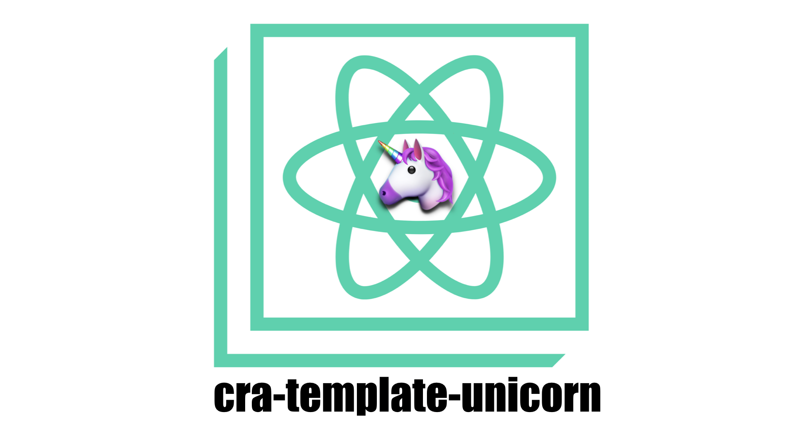

# cra-template-unicorn

 [](https://github.com/semantic-release/semantic-release) [](https://badge.fury.io/js/cra-template-unicorn)

The template for [Create React App](https://github.com/facebook/create-react-app).

## Start Template

### npx

```sh
npx create-react-app my-app --template unicorn
```

### npm

```sh
npm init react-app my-app --template unicorn
```

### yarn

```sh
yarn create react-app my-app --template unicorn
```

## In this template

- [craco](https://github.com/gsoft-inc/craco)
- [redux-toolkit](https://github.com/reduxjs/redux-toolkit)
- [react-redux](https://github.com/reduxjs/react-redux)
- [react-router](https://github.com/ReactTraining/react-router)

## Support

- Support VSCode Integration
- Support reset.css
- Support absolute path
- Customize config with craco
- Customize eslint config > [link](https://create-react-app.dev/docs/advanced-configuration)

## Show your support

Give a ⭐️ if this project helped you!

<div align="center">

<sub><sup>Written by <a href="https://github.com/JaeYeopHan">@Jbee</a></sup></sub><small>✌</small>

</div>
